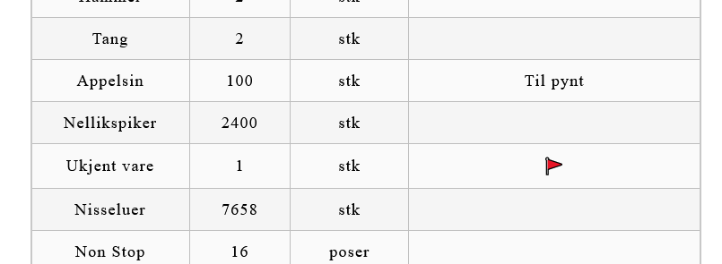
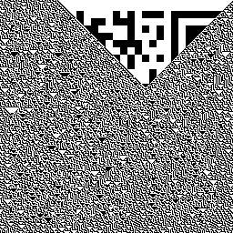

# PST Julekalender 2021
## Capture The Flag

**About**

This project contains solutions for xmas calendar at https://p26e.dev/. 
The solution is programmed in Kotlin.<br />
PST xmas calendar 2020 solution is located here: https://github.com/ditlef9/pst_julekalender_2020

**How to install**
1. Download and install Git from https://git-scm.com/downloads
2. Download and install IntelliJ from https://www.jetbrains.com/idea/download
3. In IntelliJ create new project from Git with URL https://github.com/ditlef9/pst_julekalender_2021.git

**How to run**

Go to Main.kt and click Shift+F10 to run code.

---
Contents

* [Luke 1 - eksempel_bakgrunnsbilde.png - Least Significant Bit Steganography](##-luke-1---eksempel_bakgrunnsbilde.png---least-significant-bit-teganography)
* Luke 2 - huskelapp_til_2021.txt - Polyline Coordinate Message
* Luke 3 - julekort_framsiden.jpg - Pigpen cipher decoder
* Luke 4 - verksted_npst.txt - Krøll på verkstedet
* Luke 5 - vareliste - SQL injection
* Luke 6 - Day off
* Luke 7 - AES encrypted message
* Luke 8 - frimerke.png -
* Luke 9 - npst_02_12_21_18_00.pcap -
* Luke 10 - -

---
## Luke 1 - eksempel_bakgrunnsbilde.png - Least Significant Bit Steganography ##

**Assignment:**<br />
I en melding får du bildet "eksempel_bakgrunnsbilde.png". 
Bildet bruker stenografi, altså er løsningen skjult i least significant bit.

**Solution:**<br />
Bruk stenografi kalkulatoren her: https://stylesuxx.github.io/steganography/

**Answer:**<br />
PST{HelloDASS}

---
## Luke 2 - huskelapp_til_2021.txt - Polyline Coordinate Message

**Assignment:**<br />
I en melding får du filen "huskelapp_til_2021.txt". 
Teksten minner om en liste av en liste med koordinater. 
Hva skjuler seg bak koordinatene når de plottes inn i et kart? 🤔

**Solution:**<br />
Koordinatene danner en sammenhengende strek, og når man zoomer inn ser man svaret stavet ut.

**Answer:**<br />
PST{mange snille barn i verden}


---
## Luke 3 - julekort_framsiden.jpg - Pigpen cipher decoder

**Assignment:**<br />
God fredag. Det Nordpolare Postkontor har oppdaget et julekort som er på vei til Antarktis. 
Etterretning viser at pingvinene i Antarktis ikke alltid har ren snø i skuffa. 
Det er derfor ønskelig at en alvebetjent gjennomfører en rutinemessig kontroll, 
og undersøker julekortets bakside og framside. Rapporter tilbake et eventuelt funn innpakket i pst{}.

**Solution:**<br />
Roter forsiden slik at det er opp ned.<br />
Løs bildet med Day03.kt eller manuelt med Pigpen cipher decoder: https://planetcalc.com/7842/

**Answer:**<br />
PST{JULENISSENERTEIT}

---
## Luke 4 - verksted_npst.txt - Krøll på verkstedet

**Assignment:**<br />
HMS-ansvarlig var innom verkstedet i går og var helt forskrekket over rotet vi har etterlatt oss der. Jeg er litt
opptatt med møter i dag, kan du ta deg tid til å rydde litt? Oversikt over hva vi har på verkstedet ligger vedlagt.

**Solution:**<br />


**Answer:**<br />
PST{DetBlirFortRot}

---
## Luke 5 - vareliste - SQL injection

**Assignment:**<br />
HMS-ansvarlig var innom verkstedet i går og var helt forskrekket over rotet vi har etterlatt oss der. Jeg er litt
opptatt med møter i dag, kan du ta deg tid til å rydde litt? Oversikt over hva vi har på verkstedet ligger vedlagt.

**Solution:**<br />

1. Vi ser i kildekoden at ved å skrive `hjelp` eller `Hjelp` i input for søket får vi opp et hjelpevindu. Her får vi tips om SQL-injection og en lenke til video om hvordan dette kan gjøres. Vi får også tips om å ikke bruke tilfeldige tall "som i videoen", men `null`.
2. Ved å gjøre noen vanlige søk ser vi at man får feilmeldinger dersom søkestrengen er under to tegn. I requesten vi får fra server får vi en rå feilmelding fra serveren. Den inneholder hint om type database -> PostgreSQL
3. Bare å [google](https://www.startpage.com/sp/search?query=sql+injection+postgres) opp "Postgres sql injection" 😁
4. La oss starte med og hente opp alle tabellene i basen ved å bruke søkeord `Julekuler'  UNION (SELECT '59495ce2-da82-4a01-b79a-f48b2a7c214b', table_name,null, null, null, null FROM information_schema.tables);--`
5. Vi finner usannsynlig mange tabeller inkludert tabellen `ting`. For å liste kolonnene i tabellen søker vi med `Julekuler'  UNION (SELECT '59495ce2-da82-4a01-b79a-f48b2a7c214b',  column_name, null, null , null, null FROM information_schema.columns WHERE table_name='ting');--`
6. Tabellen inneholder: antall, enhet, flagg, id, kommentar, navn
7. Flagg er interessant..

Hmm.. har ikke jeg sett det før? 😒

Hvis vi søker på `%%%` vises alle tingene. 



Merk flagget.. hva har vi fått fra server? (I Firefox -> Meny -> Flere Verktøy -> Web develoer Tools -> Network. Velg POST og klikk Response.)

```json
{
  "id": "4670e74d-59c0-4ca0-8a18-2cd58f5d1076",
  "navn": "Nellikspiker",
  "antall": 2400,
  "enhet": "stk",
  "kommentar": "",
  "flagg": null
},
{
  "id": "13b97062-dd26-41dc-bda0-58e4be6d1deb",
  "navn": "Ukjent vare",
  "antall": 1,
  "enhet": "stk",
  "kommentar": "🚩",
  "flagg": "PST{5Q1_1nj€Ⓒt10n}"
},
{
  "id": "d6177e13-a05b-4ea1-88ad-d1a617dd91f4",
  "navn": "Nisseluer",
  "antall": 7658,
  "enhet": "stk",
  "kommentar": "",
  "flagg": null
},
```

Pent og pyntelig ser vi at vi har kastet bort tiden på SQL-injections 😜

**Answer:**<br />
PST{5Q1_1nj€Ⓒt10n}

---

## Luke 6 - Day off

---

## Luke 7 - AES encrypted message

**Assignment:**<br />
Denne krypterte beskjeden skal dekrypteres:<br />
* Y2MPyYU4kblEXrEfExry4AIRAjqdke+JyQQN50Uj5GuCu5rE66lEzQXB5bE VOlNGRoU06Ny4vh/gzSPFV0mHUrxaaAVt1BwN1WN1HFT7baIejtR5KyG6 JK8yC70CpuPZV610coCiWzdFICcgEtAdQaesScLrg495kxofzG3EGvA=

**Solution:**<br />
Dekrypteringsnøkkelen må være 16 tegn. <br />
Man får hint om at dekrypteringsnøkkelen har vært utvekslet tidligere.
Ved å se på alle store bokstavene i meldingen ser man at det er AES-kryptering:<br />
* en <b><u>A</u></b>lvebetjent gjorde meg oppmerksom på at det kan ha foregått <b><u>E</u></b>n nøkkelutveksling tidligere i desember, kan<b><u>S</u></b>kje det kan hjelpe i oppklaringen?

Brevet fra Chili Willie i luke 6 er løsningen:
* PST{JULENISSENERTEIT}

Ved å gjøre de om til små bokstaver og bruke en decrypter (https://www.devglan.com/online-tools/aes-encryption-decryption) får man løsningen:

* Enter Secret Key: julenissenerteit

Dekryptert melding:

* NPSTs skal endre paa pakkefordelingsruta i aar. Det gir mulighet for aa sabotere. XOXO M. PS Ikke god jul. PS pst{nootnoot}


**Answer:**<br />
pst{nootnoot}

---

## Luke 8 - frimerke.png - 

**Assignment:**<br />
En av alvebetjentene fant et løst frimerke i postmottaket. Initielle undersøkelser viser at det ikke kan ha sittet på julekortet som kom den 3. desember, da fiberne som sitter igjen i limet ikke er av samme type som julekortet. Fiberne kan minne om setetrekket fra en reinsdyrslede klasse 8.

Motivet på frimerket er av en slik karakter at det må undersøkes nærmere. Kan du ta en titt?


**Solution:**<br />

<b><em>1) Finn RGB deler av bildet</b></em>

Ved å laste opp frimerke til https://aperisolve.fr/745da5c08083c8fbbfa4b98e6be527ef
vil man få kun rød, blå og grønn versjon av frimerket.

Rød:<br />


> b0 XOR S8("Frimerke\x00...")

Grønn:<br />


Blå:<br />



<b><em>2) Konverter grønn til desimal</b></em>

Last opp grønt bilde til https://www.dcode.fr/binary-image <br />
Da får man ut følgende binære tekst:

[frimerke_green_layer_0_binary.txt](src/main/kotlin/luke/day08/frimerke_green_layer_0_binary.txt)


<b><em>3) Konverter desimal til ASCII</b></em>

Last opp desimal til
https://gchq.github.io/CyberChef/#recipe=From_Binary('Space',8)
for å få ut ASCII.

```
.SLEDE8¡.±.x.V................................................................ñ.º.º.ú.º.º.U¿.¯Ù...1.A.Z.Ú.U³ú.Ú.7C9.U³ú.Ú...!.a.s.U`...µq.5us...q.Ev.eZ.q.5u.R....e¸W¸Y.s...a..e5µs.U°..q.Ev.¶.eZ..R..!.s.U0e°...µq.5us.U0..q.Ev.eZ.q.5u.R....e¸W¸Y.s.U0..a..e5µs.U0U°..q.Ev.¶.eZ..R..!.s.U0e°...µq.5us.U0..q.Ev.eZ.q.5u.R....e¸W¸Y.s.U0..a..e5µs.U°..q.Ev.¶.eZ..R..s.U0....c...EV.¶R...s.U0..r.e·Eua..eZ.r.5u.R..1.A s.U0....U³'Cù...s.1.A s.U0...
s.U0..U³'CY...s.1.A s.U0....U³'C.
```

Dette skal da lagres som
[txt.s8](src/main/kotlin/luke/day08/txt.s8) og lastes opp i Slede8 debugger.


<b><em>4) Last ned og installer Slede8 debugger</b></em>

* Last ned og installerer Go.
* git clone https://github.com/julebokk/slede8dbg.git
* cd slede8dbg
* go build .


<b><em>5) Debugg programmet</b></em>

Du må ha installert wsl i Windows for å kjøre disse kommandoene. Dette gjøres ved å starte
Windows Powershell som administrator og skrive

>wsl --install

Debug slede8 programmet:
* $ ./slede8dbg debug ./day08/txt.s8
* $ ./slede8dbg debug ./day08/example.asm # compiles it for you
* $ ./slede8dbg debug --input 9090cd219090 ./day08/txt.s8


**Answer:**<br />
x
---


## Luke 9 - npst_02_12_21_18_00.pcap  -

**Assignment:**<br />
Fikk tilsendt denne filen fra IT-avdelingen i går, 
de har <b>TAP</b>pet filen ut av nettverket. 
Har du mulighet til å se på den? 
Mulig den gir oss litt mer informasjon angående lekkasjen vi hadde ut til SPST. 

Husk, dette forblir mellom oss, i tilfelle det viser seg å være en av våre egne.

**Solution:**<br />
TAP står for å tappe nettverk (A network tap is a system that monitors events on a local network).


**Answer:**<br />
x
---


## Luke 10 -   -

**Assignment:**<br />
?

**Solution:**<br />
?

**Answer:**<br />
x
---